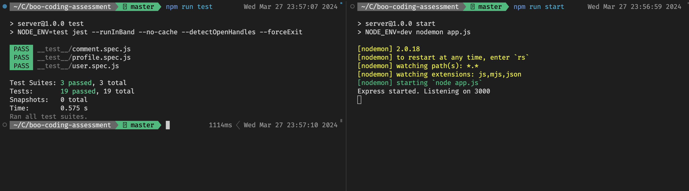

# Boo Assessments

The project is based on the MVC model (model - view - controller).

## Installation

Need to install dependencies based on `package-lock.json`

```bash
npm ci
```

Then start the application using:

```bash
npm start
```

The server is running at [http://localhost:3000](http://localhost:3000)

## Running test

The project is using e2e test ([\_\_test\_\_](./__test__/)), thus make sure to start the application before running test suites.

```bash
npm run test
```



## APIs

| Method   | Path                      | Description              |
| -------- | ------------------------- | ------------------------ |
| **GET**  | /profile/_:profileId_     | Get profile by profileID |
| **GET**  | /profile                  | Get profile list         |
| **POST** | /profile                  | Create new profile       |
| **GET**  | /user                     | Get user list            |
| **POST** | /user                     | Create new user          |
| **GET**  | /comment                  | Get comment lists        |
| **POST** | /comment                  | Create new comment       |
| **POST** | /comment/_:commentId_/like | Like/unlike feature      |
